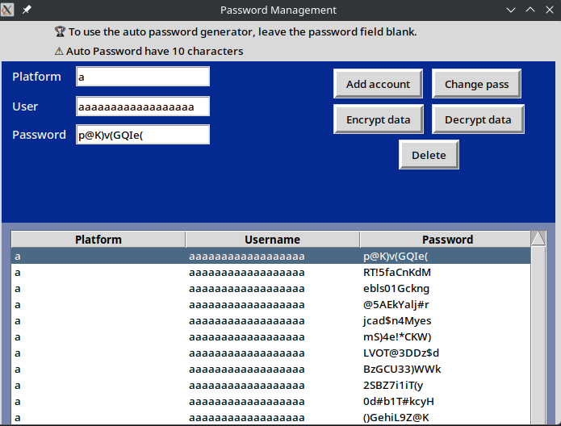
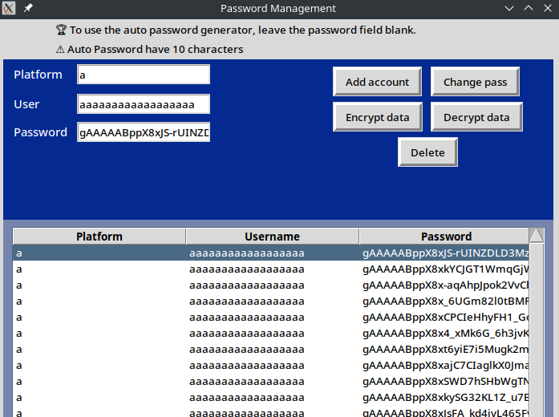

# Simple Account Management

This is a simple local CRUD script in GUI and CLI version written in Python. 
The script generate a key called "decrypt.key". Store this key in the script folder for decrypt your passwords, if you lost it, the password will be not decrypted. All account will store in the database.


To use the auto password generator, leave the password field blank. It create a password with 11 characters.
The filds are:

- Platform 
- Username 
- Password 

Only the Password field can stay blank.

Created in tkinter GUI, this is a test for front-end experience. Splited in 2 frames. Client side and tree view, no limit to store passwords.





The script use Fernet cryptograpy. Click on 'Encrypt data' button for use it. 'Decrypt data' for decrypt source.





## 🔑 Features

- Database
- Symmetric key
- Graphical User Interface (GUI)
- CRUD 
- UX 
- OOP (Object-Oriented Programming)

## 🔄 Requirements

- Python3.x
- Cryptography library


## 🚀 Usage

1. Install Python

    [Download Python](https://www.python.org/downloads)

2. Clone the repository
    ```bash
    git clone https://github.com/d4vidlinux/encrypted-password-manager.git
    cd encrypted-password-manager
    ```

3. Venv (Virtual environment)
    ```bash
    python3 -m venv venv
    source venv/bin/activate
    ```

4. Install requirements
    ```bash
    pip install -r requirements.txt
    ```

5. Execute
    ```bash
    python3 main.py
    ```

## ⚠️  Warning 

In Linux, the tkinter is not installed. Install with your package installer `python3-tk`.
Test using `python3 -m tkinter`.

The `main.py` is the init programm. Don't exclude or move the function files: `guifunctions.py` or `sqlfunctions.py`.

This project is intended for educational and personal use only.
Although it uses encryption, it has not been professionally audited and should not be considered production-ready.

If an attacker gains access to your computer, they may obtain both the encrypted database and the key file. For this reason, this tool should not be used to store highly sensitive information.
    
